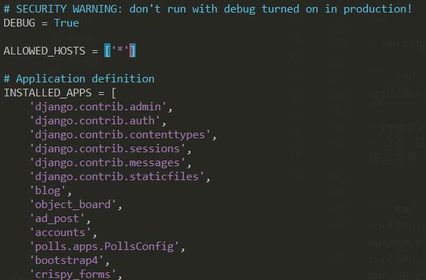

# Auzer를 이용하여 Django 배포하기
## 2편 Server 설정
------------------------
* Auzer 19.08.26버전을 기준으로 작성하였습니다. 
* Django 2.2.4 버전을 기준으로 작성하였습니다. 
* 본 글에서 사용하는 예제는 [여기](https://github.com/KoEonYack/Everyone-Exercise)  주소입니다.


- **리소스로 이동**을 클릭합니다.


- **공용 IP주소**를 확인합니다.

``` cmd
> ssh apple@52.231.64.145
```
- Auzer에서 가상머신을 만들 때 입력했던 **사용자 이름**과 **암호**를 입력합니다. 

``` cmd
The authenticity of host '52.231.64.145 (52.231.64.145)' can't be established.
ECDSA key fingerprint is SHA256:yRS1G7YZ49OFOovDQ5B1PRQTQHrsaIbxs4Mb*****.
Are you sure you want to continue connecting (yes/no)?
```
- yes를 입력합니다.

``` cmd
root@AuzerServer:/home/apple#
```
- 자 그러면 성공적으로 서버에 SSH 접속을 했습니다. 

``` cmd
root@AuzerServer:/home/apple# sudo su
```
- 관리자 권한으로 실행하기 위해서 위와 같이 입력합니다. 

``` cmd
apt-get update
apt-get upgrade
apt install python3-pip
pip3 install --upgrade pip
apt-get install apache2
apt-get install libapache2-mod-wsgi-py3
pip install "Django~=2.2.4"
```
- 위의 명령어를 차례대로 실행합니다.
- Django~=2.2.4에서 ~의 의미는 이와 비슷한 버전을 설치하라는 의미입니다. 자신의 개발한 Django 버전에 맞게 설치하셔도 무방합니다.


``` cmd
root@AuzerServer:/home/apple# git clone https://github.com/KoEonYack/Everyone-Exercise
```
- git 저장소에 저장된 코드를 클론합니다. 


``` cmd 
apple@AuzerServer:~$ vim /etc/apache2/apache2.conf
```
- /etc/apache2/의 경로에 있는 apache2.conf를 엽니다.

``` cmd
WSGIScriptAlias / /home/apple/Everyone-Exercise/EveryExercise/wsgi.py
WSGIDaemonProcess EveryExercise python-path=/home/apple/Everyone-Exercise
WSGIProcessGroup EveryExercise

<Directory /home/apple/Everyone-Exercise/EveryExercise>
<Files wsgi.py>
Require all granted
</Files>
</Directory>


Alias /static/ /home/apple/Everyone-Exercise/static/
<Directory /home/apple/Everyone-Exercise/static>
Require all granted
</Directory>
```
- apache2.conf의 맨 마지막에 위와 같이 작성합니다. 
- **WSGIScriptAlias**: 공백을기준으로 좌측에는 / 우측에는  Django 프로젝트의 wsgi.py가 있는 경로를 작성해 줍니다.  
- **WSGIDaemonProcess**: 
    - 공백을 기준으로 좌측에는 EveryExercis, 우측에는 Clone한 Django 프로젝트의 상위 디렉토리를 작성해줍니다. 
    - EveryExercise라고 하지 않아도 되지만 Django 프로젝트 이름을 할 것을 추천합니다. 
- **Directory**: wsgi.py가 있는 경로를 작성해 줍니다. 
- **Alias**: 공백을 기준으로 좌측에는 /static/ 우측에는 Django 프로젝트에서 static파일이 저장되는 곳(python3 manage.py collectstatic)의 경로를 작성합니다.
- **Directory**: **Alias**에서 작성한 경로를 다시 한번 작성해 줍니다.


- settings.py에서 ALLOWED_HOST = ['*']로 합니다.

``` cmd
apple@AuzerServer:~$ pip install -r requirements.txt
```
- requrirements.txt에 저장된 파이썬 패키지를 설치합니다. 
- 간혹 설치를 못하는 경우가 있습니다. 이럴 때는 직접 pip 명령어를 이용하여 설치하시면 됩니다. 


``` cmd
root@AuzerServer:/home/apple/Everyone-Exercise# python3 manage.py collectstatic
root@AuzerServer:/home/apple/Everyone-Exercise# python3 manage.py makemigrations 
root@AuzerServer:/home/apple/Everyone-Exercise# python3 manage.py migrate
```
- static 파일을 모아줍니다. 
- 데이터베이스를 마이그레이션 해줍니다. 


``` cmd
SystemCheckError: System check identified some issues:

ERRORS:
?: (staticfiles.E002) The STATICFILES_DIRS setting should not contain the STATIC_ROOT setting.
```
- 이와 같은 오류가 나올 경우 settings.py의 STATIC_ROOT를 주석하면 됩니다.  


``` cmd
root@AuzerServer:/home/apple/Everyone-Exercise# chmod 775 db.sqlite3
root@AuzerServer:/home/apple/Everyone-Exercise# cd ../
root@AuzerServer:/home/apple/chmod 777 EveryExercise
```
- 이 상태에서 서버를 구동하고 로그인을 하려고 하면 작동하지 않습니다. 왜냐하면 Read, Write권한을 주지 않았기 때문이죠.
- EveryExercise 전체 경로를 777로 주는 것은 위험합니다. db.sqlite3를 저장하는별도의 폴더를 만들어서 db.sqlite3를 저장한 폴더에 접근 권한을 설정하는 것을 추천합니다.  

``` cmd
apple@AuzerServer:~$ service apache2 restart
```
- 아파치 서버를 재시작합니다.


- 자 이렇게 배포를 완료했습니다.

